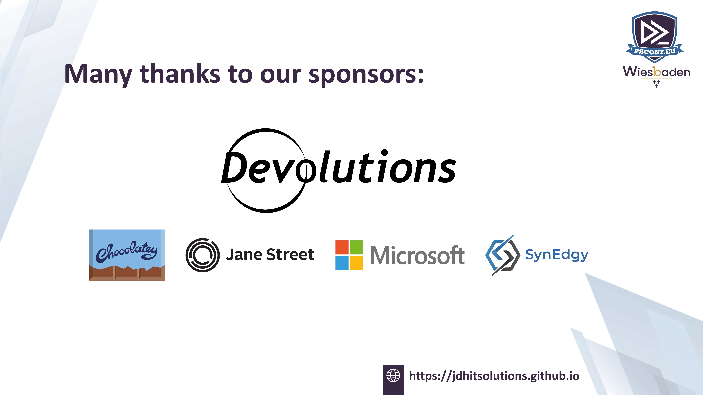

# PowerShell Open Secrets

---

## PSConfEU 2026 Wiesbaden

---

### Sponsors Make It Happen

---

### Jeff Hicks

- Old PowerShell MVP
- Even older IT Pro
- Find me

| Bluesky | Mastodon | GitHub | LinkedIn |
| :----: | :----: | :----: | :----: |
| @jdhitsolutions.com | @jeffhicks | jdhitsolutions | JefferyHicks |

- <gold1>https://jdhitsolutions.github.io</gold1>

---

### Hidden or Not Known?

* <aqua>There are thousands of PowerShell commands</aqua>
* <fuchsia>There are hundreds of PowerShell features</fuchsia>
* <darkOrange>What don't you know that might make you more efficient?</darkOrange>
* <aquamarine1>What might add value or enhance your PowerShell experience?</aquamarine1>
* <DarkOliveGreen1>What might simplify your PowerShell scripting?</DarkOliveGreen1>

---

### Show Me the Magic

---
